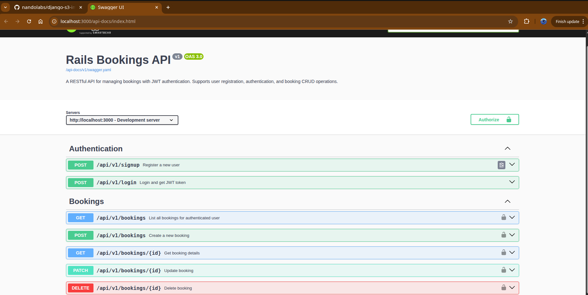

# Rails Bookings API

A clean, production-ready REST API built with **Ruby on Rails**, designed for managing bookings, customers, and availability.
I often fix ActiveRecord bugs, validation issues, and API regressions in systems like this.
Ideal for hotel systems, appointment scheduling, event reservations, or any application that needs reliable booking logic.

---

## Problem This Solves

Many platforms require a backend that can:

- Create and manage bookings  
- Track customers  
- Prevent double-bookings  
- Validate dates and availability  
- Expose clean REST endpoints for frontend or mobile applications  

Building this from scratch can be costly and time-consuming.  
This API provides a **ready-to-use, extensible booking engine** that integrates easily with any frontend (React, Vue, mobile apps, etc.)

---

## Core Features

- 🧾 **CRUD for bookings**
- 👤 **Customer management**
- 📅 **Date validation & conflict checking**
- 🔐 **API authentication (optional JWT add-on ready)**
- 🔄 **JSON-based responses for frontend integration**
- 🧪 **RSpec-ready structure for testing**
- 🗂 **Clean MVC architecture following Rails best practices**
- 🚀 **Database backed by PostgreSQL**

---

## Why This Matters for Your Project

- **Faster delivery:** Skip the boilerplate—this API already implements standard booking logic.
- **Easily customizable:** Extend models, add fields, or modify business rules quickly.
- **Frontend-ready:** Perfect for connecting React, Vue, or mobile apps.
- **Predictable structure:** Rails conventions make maintenance and handoffs easy.
- **Scalable foundation:** Works for prototypes → MVPs → production deployments.

---

# 📸 API Screenshot



# Installation

```bash
git clone https://github.com/nandolabs/rails-api-bookings
cd rails-api-bookings

bundle install
rails db:create db:migrate
rails server
```

API runs at:

```
http://localhost:3000
```

---

# API Endpoints

## 🔐 Authentication

All booking endpoints require JWT authentication.

### **Sign Up**

```
POST /api/v1/signup
Content-Type: application/json
```

**Request**

```json
{
  "email": "user@example.com",
  "password": "password123",
  "password_confirmation": "password123",
  "name": "John Doe"
}
```

**Response**

```json
{
  "token": "eyJhbGciOiJIUzI1NiIsInR5cCI6IkpXVCJ9...",
  "user": {
    "id": 1,
    "email": "user@example.com",
    "name": "John Doe"
  }
}
```

---

### **Login**

```
POST /api/v1/login
Content-Type: application/json
```

**Request**

```json
{
  "email": "user@example.com",
  "password": "password123"
}
```

**Response**

```json
{
  "token": "eyJhbGciOiJIUzI1NiIsInR5cCI6IkpXVCJ9...",
  "user": {
    "id": 1,
    "email": "user@example.com",
    "name": "John Doe"
  }
}
```

---

## 🧾 Bookings

### **Create a Booking**

```
POST /api/v1/bookings
Content-Type: application/json
Authorization: Bearer YOUR_JWT_TOKEN
```

**Request**

```json
{
  "booking": {
    "hotel_id": 1,
    "check_in": "2025-02-12",
    "check_out": "2025-02-14",
    "guests": 2
  }
}
```

**Response**

```json
{
  "id": 1,
  "user_id": 1,
  "hotel_id": 1,
  "check_in": "2025-02-12",
  "check_out": "2025-02-14",
  "guests": 2,
  "total_price": "400.0",
  "status": "pending",
  "created_at": "2025-02-10T10:00:00.000Z",
  "updated_at": "2025-02-10T10:00:00.000Z",
  "hotel": {
    "id": 1,
    "name": "Grand Hotel",
    "location": "New York",
    "description": "Luxury hotel in downtown",
    "price_per_night": "200.0"
  }
}
```

---

### **List All Bookings**

```
GET /api/v1/bookings
Authorization: Bearer YOUR_JWT_TOKEN
```

**Response**

```json
[
  {
    "id": 1,
    "user_id": 1,
    "hotel_id": 1,
    "check_in": "2025-02-12",
    "check_out": "2025-02-14",
    "guests": 2,
    "total_price": "400.0",
    "status": "confirmed",
    "hotel": {
      "id": 1,
      "name": "Grand Hotel",
      "location": "New York",
      "price_per_night": "200.0"
    }
  }
]
```

---

### **Retrieve a Booking**

```
GET /api/v1/bookings/:id
Authorization: Bearer YOUR_JWT_TOKEN
```

**Response**

```json
{
  "id": 1,
  "user_id": 1,
  "hotel_id": 1,
  "check_in": "2025-02-12",
  "check_out": "2025-02-14",
  "guests": 2,
  "total_price": "400.0",
  "status": "confirmed",
  "hotel": {
    "id": 1,
    "name": "Grand Hotel",
    "location": "New York",
    "description": "Luxury hotel in downtown",
    "price_per_night": "200.0"
  }
}
```

---

### **Update a Booking**

```
PATCH /api/v1/bookings/:id
Content-Type: application/json
Authorization: Bearer YOUR_JWT_TOKEN
```

**Request**

```json
{
  "booking": {
    "guests": 3,
    "status": "confirmed"
  }
}
```

**Response**

```json
{
  "id": 1,
  "guests": 3,
  "status": "confirmed",
  "total_price": "400.0",
  "hotel": {
    "name": "Grand Hotel"
  }
}
```

---

### **Delete a Booking**

```
DELETE /api/v1/bookings/:id
Authorization: Bearer YOUR_JWT_TOKEN
```

**Response**

```
204 No Content
```

---

## 🏨 Hotels

### **List All Hotels**

```
GET /api/v1/hotels
Authorization: Bearer YOUR_JWT_TOKEN
```

**Response**

```json
[
  {
    "id": 1,
    "name": "Grand Hotel",
    "location": "New York",
    "description": "Luxury hotel in downtown Manhattan",
    "price_per_night": "200.0"
  }
]
```

---

### **Get Hotel Details**

```
GET /api/v1/hotels/:id
Authorization: Bearer YOUR_JWT_TOKEN
```

**Response**

```json
{
  "id": 1,
  "name": "Grand Hotel",
  "location": "New York",
  "description": "Luxury hotel in downtown Manhattan",
  "price_per_night": "200.0"
}
```

---

# Database Schema

## Bookings Table

```ruby
create_table "bookings", force: :cascade do |t|
  t.bigint   "user_id", null: false
  t.bigint   "hotel_id", null: false
  t.date     "check_in"
  t.date     "check_out"
  t.integer  "guests"
  t.decimal  "total_price"
  t.string   "status"
  t.timestamps
end
```

## Hotels Table

```ruby
create_table "hotels", force: :cascade do |t|
  t.string   "name"
  t.string   "location"
  t.text     "description"
  t.decimal  "price_per_night"
  t.timestamps
end
```

## Users Table

```ruby
create_table "users", force: :cascade do |t|
  t.string   "email"
  t.string   "password_digest"
  t.string   "name"
  t.timestamps
end
```

---

# Extending the API

You can easily add:

* Payment processing
* Room inventory management
* Availability search endpoints
* Customer accounts with Devise or JWT
* Admin dashboard

Rails makes extending this API extremely fast.

---

# Tech Stack

* **Ruby 3.x**
* **Rails 7 API mode**
* **PostgreSQL**
* **RSpec (optional)**

---


## NandoLabs

Delivering clean, reliable backend APIs with Rails, Django, FastAPI, and Node.js.

